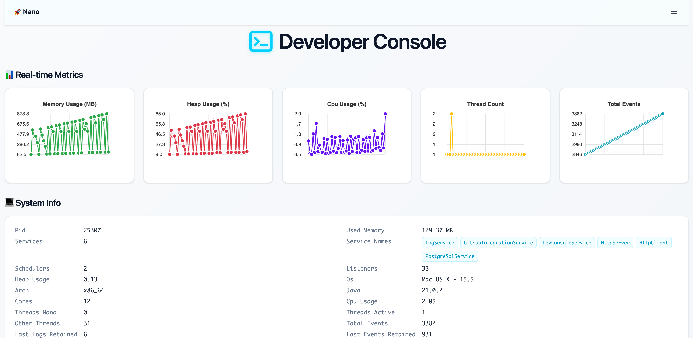

# Nano Dev Console Service

The **Nano Dev Console** is a lightweight, drop-in module for any Nano-based application that gives you **runtime visibility** into events, logs, and system metrics. It exposes a small HTTP UI + JSON endpoints and requires **no code changes** in your app beyond adding the dependency.



---

## Features

- **Live event stream** with pause & export (excludes Dev Console’s own HTTP requests)
- **Live logs** with pause & export
- **System snapshot** (PID, heap usage, CPU %, thread counts, service list)
- **Change runtime configurations** via Config panel
- **Zero app wiring** — subscribes to all event channels automatically

---

## Compatibility

- **Nano:** Tested with `2025.1.4`  
- **Java:** Recommended LTS 21 (no issues detected with JDK 25 until now)  
- **Packaging:** JAR

---

## Installation

1) Build and install this project locally:

```bash
mvn clean install
```

2) Add the dependency to your Nano app:

```xml
<!-- Dev Console -->
<dependency>
  <groupId>org.nanonative</groupId>
  <artifactId>devconsole</artifactId>
  <version>1.0.0</version>
</dependency>

<!-- Your app must already depend on Nano -->
<dependency>
  <groupId>org.nanonative</groupId>
  <artifactId>nano</artifactId>
  <version>${nano.version}</version>
</dependency>
```

Once on the classpath, the service starts with your app and exposes the UI.
```java
        Nano nano = new Nano(Map.of(
            CONFIG_SERVICE_HTTP_PORT, "8080"
        ), new DevConsoleService(), new HttpServer(), new MyAppService(), new OtherAppService());

```
---

## Configuration

Config keys are registered via Nano’s config system. You can set them via your usual mechanism (e.g., env, file, system props). Defaults shown below.

| Key                      | Type   | Default  | Description                                                                  |
|--------------------------|--------|--------- |------------------------------------------------------------------------------|
| `dev_console_max_events` | int    | `1000`   | Max events retained in memory                                                |
| `dev_console_max_logs`   | int    | `1000`   | Max logs retained in memory                                                  |
| `dev_console_url`        | string | `/ui`    | UI path under `/dev-console` (e.g., `/alex` → UI at `/dev-console/alex`)     |

**Examples**

```bash
# HTTP UI (local)
http://localhost:8080/dev-console/ui
```

---

## Metrics shown in the UI

- **Memory Usage (MB):** Process memory reported by Nano.
- **Heap Usage (%):** % of current heap used; relative to your `-Xmx` setting.
- **CPU Usage (%):** Process CPU load
  - Interpreted as **share of total machine CPU** (0–100 per JVM, not per core)

- **Thread Count:** Application thread counts and other JVM threads.
- **Total Events:** Cumulative events seen by the application.

You can **pause** charts to inspect, and **export** events/logs as text.

---


## How it works (under the hood)

- Subscribes to **all event channels**, handles Dev Console HTTP events internally, and records everything else in memory concurrent deques.
- Uses (`ConcurrentLinkedDeque`) and weakly consistent iteration for low overhead and high concurrency;
- Filters out its **own** HTTP requests so UI traffic doesn’t pollute the event stream.

---

## Security & Ops

- Intended for **development/test** by default. For production, do not include DevConsoleService().
- Memory footprint scales with `maxEvents`. 1 GB heap comfortably holds ~1.5K events. add ~800 events per extra GB of -Xmx.
- The Dev console stores state **in memory only**; restart clears histories.
- If needed to run this project (Main) as a standalone:
* Add plugin to the pom of this project:
```xml
<plugin>
  <groupId>org.codehaus.mojo</groupId>
  <artifactId>exec-maven-plugin</artifactId>
  <version>3.2.0</version>
  <configuration>
    <mainClass>org.nanonative.devconsole.Main</mainClass>
  </configuration>
</plugin>
```
* Remove the provided scope of Nano artifact in the pom


### Recommendations for users
  Pick a budget, then size maxEvents:
  For your current event payloads, a conservative rule of thumb from these runs is:
  1 GB heap comfortably holds ~1.5k events, Logs are lightweight String objects and 10K logs are estimated to take around ~2 MB (0.02 GB)
  add ~900 events per extra GB of -Xmx (ConcurrentLinkedDeque accounts a tiny memory for linkage)
  For long-running, high-throughput workloads, the table below guides memory sizing. The Retained events mark the point at which Nano terminated with EVENT_APP_OOM (OutOfMemory Error)

  | GC  | `-Xmx` | `MaxDirectMemorySize` | Retained events |
  | --- | ------ | --------------------- | --------------- |
  | G1  | 1 g    | 64 m                  | 1836            |
  | G1  | 1 g    | 128 m                 | 1943            |
  | G1  | 1 g    | 256 m                 | 2100            |
  | ZGC | 1 g    | 256 m                 | 1580            |
  | G1  | 2 g    | 256 m                 | 2633            |
  | G1  | 2 g    | 512 m                 | 2399            |
  | G1  | 3 g    | 256 m                 | 3584            |
  | G1  | 3 g    | 512 m                 | 2102            |

> Note: These tests were performed by keeping the -Xms and -Xmx values same.

---

## URLs & Endpoints

> The Dev Console is mounted under `BASE_URL = /dev-console`.

| Method | Path                                    | Description                              |
|-------:|-----------------------------------------|------------------------------------------|
|  GET   | `/dev-console/system-info`              | JSON snapshot of system & JVM info       |
|  GET   | `/dev-console/events`                   | JSON list of recent events               |
|  GET   | `/dev-console/logs`                     | JSON list of recent logs                 |
| PATCH  | `/dev-console/config`                   | Update runtime config (see below)        |
|  GET   | `/dev-console/<uiPath>` (default `/ui`) | Dev Console UI (HTML)                    |
|  GET   | `/dev-console/{fileName}`               | Static UI assets                         |

> Note: Dev Console HTTP requests are **not** recorded as events.

